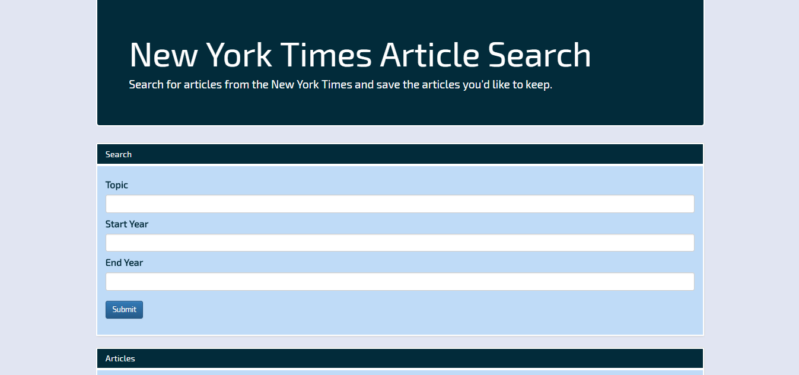

# NYT React Search Application

This application uses MongoDB, Express, React, and Node to create full stack application.

The application allows the user to search for articles from the New York Times API and then save those articles within a database. 

When the page loads the user is brought to a single page application. 

Here the user can search: 

Below the search form, the results from the search are render:

Once the articles render from the search, the user is given the option to save the article. Once the user hits save, the article is added to this database and then is rendered here:

The user is given the option to delete the article and when the button is clicked the article is removed from the database.

